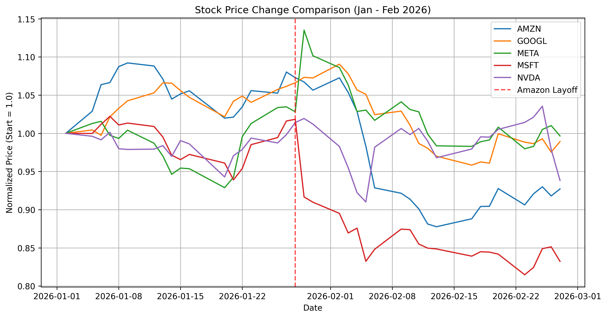

# Amazon Stock Performance Analysis: A Month After 2026 Layoff

## Description
This project analyzes the impact of the **January 28, 2026** Amazon layoffs on its stock price. It compares Amazon's (AMZN) performance to other major US tech companies (Google, Meta, Microsoft, and NVIDIA) specifically for the **one month following the announcement**.

The analysis uses normalized closing prices, **setting the price on January 1, 2026, as the baseline of 1.0**, to facilitate a direct comparison of relative performance trends among the companies.

## Visualization

## Key Findings
* **Initial Reaction**: Following the layoff announcement on January 28, 2026, Amazon's stock experienced a significant drop, aligned with typical market behavior where investors react negatively to layoff news.
* **Comparative Trend**: Despite the initial dip, Amazon's recovery showed resilience compared to peers like Microsoft (MSFT), which continued a steeper decline during early February.

## Technical Stack
* **Python 3**: Programming language
* **yfinance**: For downloading historical stock data
* **pandas**: For data manipulation and normalization
* **matplotlib**: For creating the visualization

